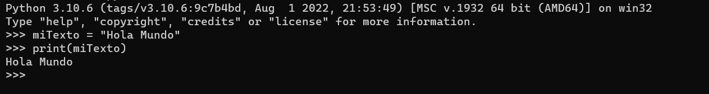

# OB Curso de Python
## Ejercicio 1

Desde la consola de python almacena la cadena **“Hola mundo!” en una variable y muéstrala.**

Tienes que subir capturas de pantalla en una carpeta comprimida zip.

### Ejercicio Print de Pantalla:

