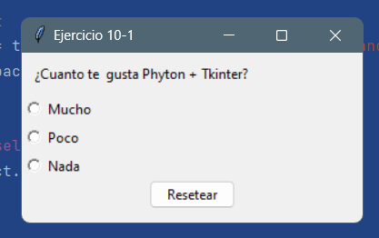

# OB Curso de Python
## Ejercicio 10.1
**Enunciado del ejercicio:**

En este ejercicio tenéis que crear una lista de RadioButton que muestre la opción que 
se ha seleccionado y que contenga un botón de reinicio para que deje todo como al principio.

Al principio no tiene que haber una opción seleccionada.

### Codigo Python:

```python
from tkinter import (Tk, ttk, Label, Radiobutton, IntVar)


class SimpleGUI(Tk):

    def __init__(self):
        super().__init__()
        self.iniciarUI()

    def iniciarUI(self):
        self.title("Ejercicio 10-1")
        self.minsize(300, 150)  # MIN width, height
        self.maxsize(300, 150)  # MAX width, height
        self.geometry("400x150+550+50")  # centrar ventana
        self.generarWin()

    def generarWin(self):
        tituloLabel = Label(self, text="¿Cuanto te  gusta Phyton + Tkinter?", bd=10)
        tituloLabel.pack(anchor='w')

        # Seleccion Radiobutton
        self.varSelect = IntVar()
        self.varSelect.set(-1)

        # Lista de Radiobutton
        self.listaDeOpciones = ["Mucho", "Poco", "Nada"]

        # generar todas las lista de opciones en la UI
        for val, txt in enumerate(self.listaDeOpciones):
            self.listRB = Radiobutton(self, text=txt, variable=self.varSelect, value=val)
            self.listRB.pack(anchor='w')

        # Boton Reset
        next_button = ttk.Button(self, text="Resetear", command=self.btnResetear)
        next_button.pack()

    def btnResetear(self):
        self.varSelect.set(-1)


if __name__ == "__main__":
    app = SimpleGUI()
    app.mainloop()
```

### Salida en consola:
