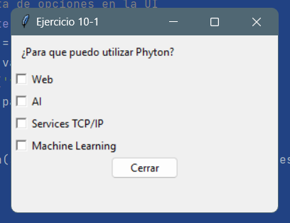

# OB Curso de Python
## Ejercicio 10.2
**Enunciado del ejercicio:**

En este segundo ejercicio, tendréis que crear una interfaz sencilla la cual debe de 
contener una lista de elementos seleccionables, también debe de tener un label 
con el texto que queráis.

### Codigo Python:

```python
from tkinter import (Tk, ttk, Label, Checkbutton, IntVar)


class SimpleGUI(Tk):

    def __init__(self):
        super().__init__()
        self.iniciarUI()

    def iniciarUI(self):
        self.title("Ejercicio 10-1")
        self.minsize(300, 200)  # MIN width, height
        self.maxsize(300, 200)  # MAX width, height
        self.geometry("400x200+550+50")  # centrar ventana
        self.generarWin()

    def generarWin(self):
        tituloLabel = Label(self, text="¿Para que puedo utilizar Phyton?", bd=10)
        tituloLabel.pack(anchor='w')

        # Lista de Checkbutton
        listaDeOpciones = ["Web", "AI", "Services TCP/IP", "Machine Learning"]
        self.listCheck = {}

        # generar todas las lista de opciones en la UI
        for val, txt in enumerate(listaDeOpciones):
            self.listCheck[txt] = Checkbutton(self, text=txt)
            self.listCheck[txt].var = IntVar()
            self.listCheck[txt]['variable'] = self.listCheck[txt].var
            self.listCheck[txt].pack(anchor='w')

        # Boton Reset
        next_button = ttk.Button(self, text="Cerrar", command=self.btnResetear)
        next_button.pack()

    def btnResetear(self):
        self.quit()


if __name__ == "__main__":
    app = SimpleGUI()
    app.mainloop()

```

### Salida en consola:
