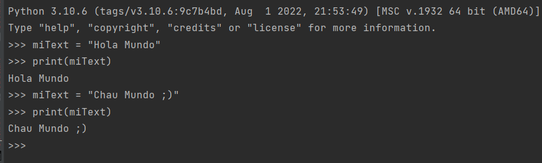

# OB Curso de Python
## Ejercicio 2

Modifica la variable del anterior ejercicio en la consola de python 
y después muestrala por consola para ver la modificación de la variable.

Tienes que subir capturas de pantalla en una carpeta comprimida zip.

### Ejercicio Print de Pantalla:

