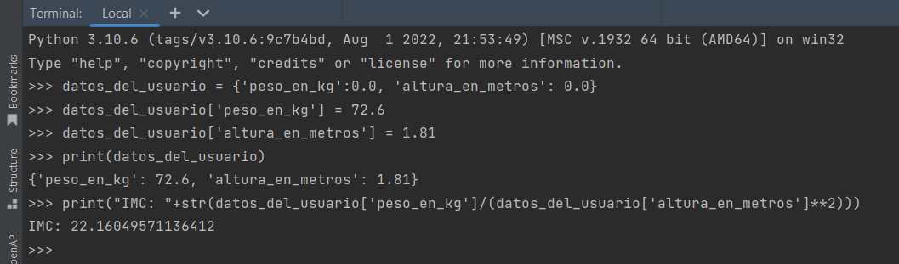

# OB Curso de Python
## Ejercicio 3

Escribe un programa en la consola de python que pida al usuario su peso (en kg) y estatura (en metros), 
calcule el índice de masa corporal y lo almacene en una variable, e imprima por pantalla la frase 

Tu índice de masa corporal es donde es el índice de masa corporal calculado redondeado con dos decimales. 

Tienes que subir capturas de pantalla en una carpeta comprimida zip.

### Ejercicio Print de Pantalla:




### Codigo Python:

```python
datos_del_usuario = {'peso_en_kg':0.0, 'altura_en_metros': 0.0}
datos_del_usuario['peso_en_kg'] = 72.6
datos_del_usuario['altura_en_metros'] = 1.81
print(datos_del_usuario)
print("IMC: "+str(datos_del_usuario['peso_en_kg']/(datos_del_usuario['altura_en_metros']**2)))
```
