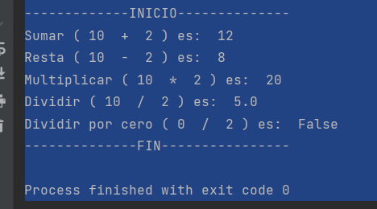

# OB Curso de Python
## Ejercicio 7.1
**Enunciado del ejercicio:**

En este ejercicio tendréis que crear un módulo que contenga las operaciones básicas de una calculadora: sumar, restar, multiplicar y dividir.

Este módulo lo importaréis a un archivo python y llamaréis a las funciones creadas. Los resultados tenéis que mostrarlos por consola.

### Codigo Python:

```python
import calculadora as cal

valor1 = 10
valor2 = 2

print('-------------INICIO--------------')
print("Sumar (", valor1, " + ", valor2, ") es: ", cal.suma(valor1, valor2))
print("Resta (", valor1, " - ", valor2, ") es: ", cal.resta(valor1, valor2))
print("Multiplicar (", valor1, " * ", valor2, ") es: ", cal.multiplicar(valor1, valor2))
print("Dividir (", valor1, " / ", valor2, ") es: ", cal.dividir(valor1, valor2))
valor1 = 0
print("Dividir por cero (", valor1, " / ", valor2, ") es: ", cal.dividir(valor1, valor2))
print('--------------FIN----------------')
```

### Salida en consola:
