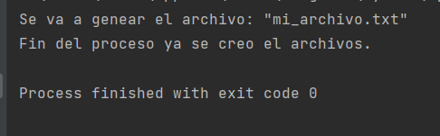

# OB Curso de Python
## Ejercicio 8.1
**Enunciado del ejercicio:**

En este ejercicio, tendréis que crear un archivo py donde creéis un archivo txt,
lo abráis y escribáis dentro del archivo. Para ello, tendréis que acceder dos veces al archivo creado.

### Codigo Python:

```python
def abrir_y_escribir_dos_veces():
    # Crear el archivo de texto y escribe
    f =  open('mi_archivo.txt', 'w')
    f.write('Ejercicio 8.1 crear y escribir\n')
    f.close()

    # Abrir el archivo y escribir de nuevo
    f = open('mi_archivo.txt', 'a')
    f.write('Abrir de nuevo y escribir de nuevo.\n')
    f.close()

# Ejercicio 8.1
abrir_y_escribir_dos_veces()
```

### Salida en consola:
