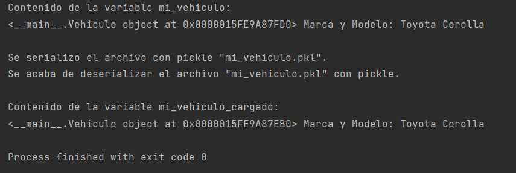

# OB Curso de Python
## Ejercicio 8.2
**Enunciado del ejercicio:**

En este segundo ejercicio, tendréis que crear un archivo py y dentro crearéis una clase Vehículo,
haréis un objeto de ella, lo guardaréis en un archivo y luego lo cargamos.

### Codigo Python:

```python
import pickle

class Vehiculo:
    def __init__(self, marca, modelo):
        self.marca = marca
        self.modelo = modelo

    def __str__(self):
        return f'{self.marca} {self.modelo}'


# Ejercicio 8.2
# Crear un objeto Vehiculo
mi_vehiculo = Vehiculo('Toyota', 'Corolla')
print('Contenido de la variable mi_vehiculo:')
print(mi_vehiculo.__repr__(), 'Marca y Modelo:', mi_vehiculo, '\n')

# Guardar el objeto en un archivo
f = open('mi_vehiculo.pkl', 'wb')
pickle.dump(mi_vehiculo, f)
print('Se serializo el archivo con pickle "mi_vehiculo.pkl".')

# Cargar el objeto desde el archivo
f = open('mi_vehiculo.pkl', 'rb')
mi_vehiculo_cargado = pickle.load(f)
print('Se acaba de deserializar el archivo "mi_vehiculo.pkl" con pickle.\n')

print('Contenido de la variable mi_vehiculo_cargado:')
print(mi_vehiculo_cargado.__repr__(), 'Marca y Modelo:', mi_vehiculo_cargado)

```

### Salida en consola:
