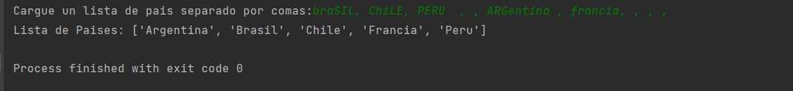

# OB Curso de Python
## Ejercicio 9.1
**Enunciado del ejercicio:**

Crea un script que le pida al usuario una lista de países (separados por comas). 
Éstos se deben almacenar en una lista. No debería haber países repetidos (haz uso de set). 
Finalmente, muestra por consola la lista de países ordenados alfabéticamente y separados por comas.

### Codigo Python:

```python
while True:

    paises_stg = input('Cargue un lista de pais separado por comas:')
    paises = paises_stg.split(',')
    if len(paises) < 2:
        print('¡Por favor cargue al menos un pais!')
    else:
        break

lista_de_paises = set()
for pais in paises:
    pais = pais.strip()
    if len(pais) > 0:
        lista_de_paises.add(pais.strip().title())

if len(lista_de_paises) > 0:
    lista_de_paises = sorted(lista_de_paises)
    print('Lista de Paises:', lista_de_paises)
else:
    print('No se cargo ningún pais')
```

### Salida en consola:
