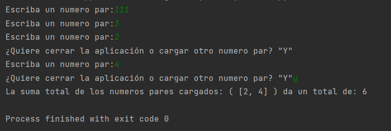

# OB Curso de Python
## Ejercicio 9.2
**Enunciado del ejercicio:**

En este segundo ejercicio, tenéis que crear una aplicación que obtendrá los elementos impares de una lista pasada 
por parámetro con filter y realizará una suma de todos estos elementos obtenidos mediante reduce.

### Codigo Python:

```python
def es_par(num):
    try:
        num = int(num.strip())
        if (num % 2) == 0:
            return True
    except ValueError as e:
        print('Por favor cargue un numero')
    return False


list_de_numeros_par = []
while True:
    num_stg = input('Escriba un numero par:')
    if len(num_stg.strip()) > 0:
        if es_par(num_stg) == True:
            list_de_numeros_par.append(int(num_stg.strip()))
        else:
            continue
    else:
        continue

    accion = input('¿Quiere cerrar la aplicación o cargar otro numero par? "Y"')
    if (accion.upper() == 'Y'):
        break

print("La suma total de los numeros pares cargados: (", list_de_numeros_par,") da un total de:",sum(list_de_numeros_par))
```

### Salida en consola:
